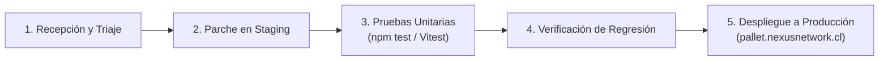

# 🛡️ POLÍTICA DE SEGURIDAD Y GESTIÓN DE VULNERABILIDADES
**Sistema:** Control Outbound CIAL (Nexus Pallets)  
**Entidad:** CIAL Alimentos — Gerencia de Logística & Tecnología  
**Versión:** 1.0.0  
**Fecha:** Octubre 2026

---

## 1. Declaración de Compromiso con la Seguridad

El equipo de desarrollo de **Control Outbound** mantiene un compromiso activo con la seguridad de la información, la inocuidad operacional y la protección de los datos de despacho de CIAL Alimentos, en alineación con los marcos **CIS Controls v8** y **NIST SSDF**.

---

## 2. Reporte Responsable de Vulnerabilidades

Si cualquier colaborador, auditor de TI o especialista en ciberseguridad identifica una potencial debilidad, falla de control de acceso o vulnerabilidad en la solución, solicitamos reportarla de inmediato mediante el siguiente canal formal:

* **Responsable Técnico:** Ariel Mella (`ariel.mella@cial.cl`)
* **Asunto sugerido:** `[REPORTE SEGURIDAD NEXUS OUTBOUND] Descripción breve`
* **Información requerida:**
  1. Componente o URL afectada.
  2. Pasos detallados para reproducir el hallazgo.
  3. Prueba de concepto (PoC) o captura de pantalla.
  4. Impacto estimado sobre la confidencialidad, integridad o disponibilidad.

> ⚠️ **Política de Divulgación Responsable:** Solicitamos no divulgar públicamente ningún hallazgo ni intentar explotar datos reales de despacho mientras el equipo evalúa y aplica la remediación correspondiente.

---

## 3. Clasificación de Severidad y SLA de Remediación

Los hallazgos de seguridad se clasifican utilizando el estándar **CVSS v3.1** (Common Vulnerability Scoring System) con los siguientes plazos máximos de atención:

| Severidad | Puntuación CVSS | Tiempo de Respuesta Inicial | SLA de Corrección y Despliegue |
|---|:---:|:---:|:---:|
| **Crítica** | 9.0 – 10.0 | Inmediato (< 4 horas) | **< 24 horas** (Hotfix urgente) |
| **Alta** | 7.0 – 8.9 | < 12 horas | **< 72 horas** |
| **Media** | 4.0 – 6.9 | < 24 horas | **< 7 días hábiles** |
| **Baja / Informativa** | 0.1 – 3.9 | < 48 horas | **Próximo ciclo de release** |

---

## 4. Proceso de Corrección y Pruebas de Regresión

Toda corrección de vulnerabilidad sigue el siguiente ciclo de vida controlado:

1. **Aislamiento y Reproducción:** Validación en el ambiente de Staging (`.env.staging`).
2. **Desarrollo del Parche:** Aplicación del principio de mínimo privilegio y sanitización estricta.
3. **Pruebas de Regresión Automatizadas:** Ejecución de la suite `npm test` para asegurar que el parche no afecte los cálculos de bandejas, saldos zonales ni SLAs de salida.
4. **Despliegue Controlado:** Publicación en producción con registro de commit trazable en GitHub y notificación a Informática.
