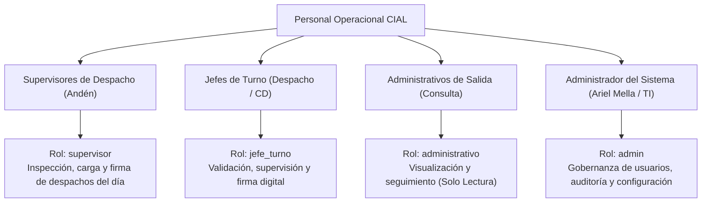

# 📋 FICHA TÉCNICA: DEFINICIÓN DE INFORMACIÓN, USUARIOS E INTEGRACIONES
**Sistema:** Control Outbound CIAL (Nexus Pallets)  
**Versión:** 1.2.0 (Producción)  
**Fecha:** Octubre 2026  
**Estándares de Referencia:** CIS Controls v8 (Control 16: Application Software Security), NIST SSDF (Secure Software Development Framework)

---

## 1. Identificación y Clasificación de la Información Procesada

De acuerdo con las políticas corporativas de gobierno de datos de CIAL Alimentos, la aplicación **Control Outbound** opera bajo la siguiente clasificación de activos de información:

| Categoría de Dato | Datos Específicos | Clasificación | Justificación / Controles |
|---|---|---|---|
| **Datos de Despacho Operacional** | Número de camión, patente, número de andén, hora de cierre de puertas, kilos brutos, observaciones operativas. | **Uso Interno Operacional** | Información de control logístico interno. No contiene datos comerciales de precios, costos ni facturación monetaria. |
| **Control de Pallets y Bandejas** | Conteo de pallets de madera (estándar/azul), pallets de plástico, bases, bandejas carniceras por zonal de destino. | **Uso Interno Operacional** | Balance físico de embalaje retornable entre CD San Bernardo y zonales. |
| **Control de Cadena de Frío** | Temperaturas de 1er, 2do y 3er termógrafo del furgón frigorífico. | **Crítico Operacional (Calidad)** | Control de inocuidad alimentaria (norma de congelados: -18°C). Su alteración está protegida por validaciones de negocio y RLS. |
| **Checklist de Seguridad Física** | Postura de andén, limpieza de estructura, luces de andén, separadores térmicos, conteo y fotos de lingas/colchonetas. | **Uso Interno Operacional** | Inspección física del camión previo a la salida de andén. |
| **Identidad y Firmas Digitales** | Nombre de supervisor, correo corporativo (`@cial.cl`), cargo para firma, firma digital manuscrita en formato SVG/Base64. | **Confidencial Laboral** | Trazabilidad del responsable de la inspección y del despacho. Las firmas no son biometría sensible externa, sino validación de visto bueno interno. |
| **Credenciales y Acceso** | Correos corporativos `@cial.cl`, tokens JWT de sesión (Supabase Auth). | **Confidencial Estricto** | Las contraseñas están almacenadas mediante hash irreversible **bcrypt/Argon2** en Supabase Auth. La aplicación web jamás almacena contraseñas en texto claro. |

> 🔒 **Aclaración para Informática / Auditoría:** La aplicación **NO procesa ni almacena**:
> - Datos bancarios ni tarjetas de crédito/débito.
> - Datos personales sensibles de clientes finales (RUT, domicilios particulares, teléfonos de consumidores).
> - Listas de precios, márgenes de venta ni contratos comerciales.

---

## 2. Definición de Usuarios y Población Objetivo

La aplicación está diseñada para ser utilizada exclusivamente por personal autorizado de la Gerencia de Logística y Cadena de Suministro de CIAL Alimentos:



* **Población Estimada:** 25 a 35 usuarios simultáneos en turnos rotativos 24/7.
* **Dispositivos:** Tablets industriales rugerizadas en andén, terminales táctiles fijas y computadores de oficina técnica.
* **Dominio Obligatorio:** Exclusivamente cuentas con sufijo `@cial.cl`. Se rechaza programáticamente cualquier correo ajeno a la organización.

---

## 3. Identificación de Integraciones con Otros Sistemas

La arquitectura de la solución ha sido diseñada minimizando la superficie de integración para evitar acoplamientos inseguros:

```mermaid
flowchart LR
    subgraph Cliente["Frontend (PWA / SPA)"]
        UI["React 19 + Vite<br/>pallet.nexusnetwork.cl"]
    end

    subgraph Hosting["Infraestructura Cloud"]
        Vercel["Vercel Edge Network<br/>TLS 1.3 / WAF"]
    end

    subgraph Backend["Base de Datos & Auth"]
        SupaStaging["Supabase Staging<br/>(iuzpgljjfeobxlptmsma)"]
        SupaProd["Supabase Producción<br/>(qtzpzgwyjptbnipvyjdu)"]
    end

    subgraph Notificaciones["Salidas Externas"]
        Mailto["Cliente de Correo Local<br/>(Outlook / Webmail CIAL)"]
    end

    UI -->|HTTPS / WSS| Vercel
    UI -->|REST API Parametrizada / JWT| SupaStaging
    UI -->|Ambiente Prod (.env.production)| SupaProd
    UI -.->|mailto: URI scheme (Cliente)| Mailto
```

1. **Supabase Cloud (PostgreSQL + Auth + Storage):**
   * **Protocolo:** HTTPS / WSS con TLS 1.3 forzado.
   * **Autenticación:** Tokens JWT rotativos con expiración y anon-key pública limitada por Row Level Security (RLS).
   * **Storage:** Bucket `dispatch-photos` para almacenamiento de fotografías de lingas, colchonetas y sellos de carga.
2. **Vercel Edge Hosting:**
   * Despliegue estático inmutable con certificado SSL/TLS automático gestionado por Vercel.
   * Encabezados de seguridad HTTP y protección contra ataques DDoS y bots.
3. **Integración con Clientes de Correo (Outlook / Webmail):**
   * Generación de minutas de despacho mediante enlaces controlados `mailto:` en el dispositivo del supervisor, sin enviar correos a través de servidores SMTP no auditados.

---

## 4. Requisitos Mínimos de Seguridad Durante el Ciclo de Vida (SDLC)

1. **Separación Estricta de Entornos (CIS Control 16.8):**
   * Base de datos de Staging (Marcha Blanca / Capacitación) completamente independiente de la base de Producción.
2. **Pruebas Automatizadas en CI/CD (CIS Control 16.12):**
   * Ejecución obligatoria de la suite `npm test` (Vitest) antes de cada paso a producción.
3. **Control de Inactividad de Terminales:**
   * Cierre forzado de sesión a los 15 minutos de inactividad para evitar el uso indebido de tablets en andenes desatendidos.
4. **Política de Cero Vulnerabilidades en Dependencias:**
   * Auditoría automatizada continua con `npm audit` y bloqueo ante vulnerabilidades altas o críticas.
